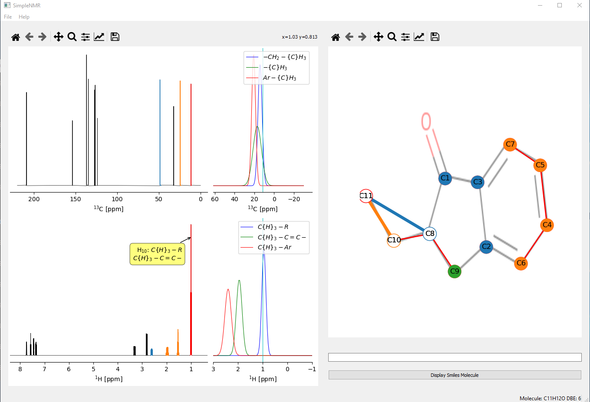
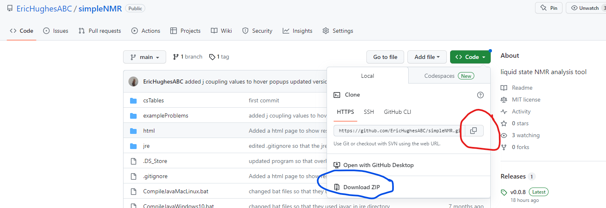

# simpleNMR

simpleNMR is a python/QT5/matplotlib program. It runs on windows and macos. The aim of the software is to present the information derived from processing NMR spectra using commercial software such as MestReNova (chemical shifts, integrals, coupling patterns, and correlations from standard 2D experiments) in a way that makes it easier for the user to understand and keep track of the information while verifying a proposed structure.

The program displays the data  in an interactive manner. The idea behind the program was to position it as an analysis tool between the raw data and the use of pencil and paper to analyse NMR data and commercial, complete black box solutions that can provide an answer with very little manual intervention. The software takes a high level interactive approach to display the information from the NMR experiments in order quickly check if a proposed structure is consistent with the NMR data.

The screenshot below shows the main user interface of the program. It consists of two panels: The right-hand panel shows the proton and carbon 1-D spectra of the molecule. The left-hand side panel shows an image of the proposed molecule provided by the user on top of which are placed the carbon atoms of the molecule. COSY data is shown as red links between carbon atoms.  The carbon atoms/nodes can be moved over the background molecule so that they align with the corresponding atoms in the proposed molecule. HMBC corelations are displayed on the molecule when the cursor is positioned over a carbon atom. The corresponding proton and carbon peaks are highlighted in the spectra panel.

Furthermore, when a peak is highlighted in the spectra panel, the peak is highlighted in red, if the peak has a corresponding carbon/proton peak it is  highlighted. HMBC correlations are shown by highlighting further peaks in different colours and showing the links in the molecule panel. Information on what the chemical shift might correspond to in terms of functional group is shown up in a pop-up.

The initial positions of the carbon atom nodes over the background molecule image can be set randomly, from a previously saved session, or by using the JAVA HOSE code that can be found on [nmrshiftdb](https://nmrshiftdb.nmr.uni-koeln.de/) website which has been incorporated into the program.




## Installation

There are two ways to install simpleNMR, both involve accessing the simpleNMR public github site [simpleNMR](https://github.com/EricHughesABC/simpleNMR/tree/main). 

The first involves downloading a packaged executable, either for windows 10 or MacOs. The files can be found in the releases folder. [simpleNMR Release latest](https://github.com/EricHughesABC/simpleNMR/releases). 

A python environment is  not required to use these executables as all the required modules and python interpreter come with the executable. The executable takes quite a while to start when the file is first ran. The permissions of the file have to be changed for the macOs version and instructions can be found below. 

The second method requires a modern python 3.7 or later working python environment on the computer. The modules that the program uses are best installed using pip from a requirements file that is part of the github repository

#### SimpleNMR executables

1. **Windows 10**: [simpleNMRwin10](https://github.com/EricHughesABC/simpleNMR/releases/download/verrsion_0.0.10/simpleNMRwin.exe  "simpleNMRwin10")

   

2. **macOS** [simpleNMRmac](https://github.com/EricHughesABC/simpleNMR/releases/download/verrsion_0.0.10/simpleNMRmac  "simpleNMRmac")

   1. **Change Permissions**: In a command line window change the permissions on the file

      ```markdown
      chmod 744 simpleNMRmac
      ```

   2. **Running for the first time**: Then, when you try to run it from the finder window (file browser) it won’t run if you just double click on it because it isn’t certified, so you need to right click on it and choose “Open” and then confirm that it is OK to run it. You only need to do that the first time you open it. After that, it is fine, though it does take a few (tens of) seconds to start up.

#### Installing the exampleProblems from GitHub

There are a number of example problems in the folder `exampleProblems`. To obtain this folder from the github repository download the zip or tar.gz file of the source code from the releases folder  [simpleNMR Release v0.0.10](https://github.com/EricHughesABC/simpleNMR/releases/tag/verrsion_0.0.10) and unzip the file.

#### Installation from Github

To clone the [simpleNMR](https://github.com/EricHughesABC/simpleNMR/tree/main) GitHub repository, follow these steps:

1. **Install github**: Intall the command line version of git on your computer [Git Guides - install git (github.com)](https://github.com/git-guides/install-git) 

2. **Copy the Repository URL**: Go to the [simpleNMR](https://github.com/EricHughesABC/simpleNMR/tree/main) GitHub repository and find the green "Code" button. Click on the red circled button to copy the repository URL. If you have not installed git on your computer, the repository can be downloaded in a zip format by clicking on the menu item circled in blue.

   

   

3. **Open a Terminal/Command Prompt**: Open a terminal or command prompt window on your local machine.

4. **Navigate to the Destination Directory**: Navigate to the directory where you want to clone the repository. You can use the `cd` command to change directories. For example, if you want to clone the repository into say "mySimpleNMR" folder, you can use the following command:

   ```markdown
   cd mySimpleNMR
   ```

5. **Clone the Repository**: In the terminal, use the `git clone` command followed by the  simpleNMR repository URL you copied in step 1. For example:

   ```markdown
   git clone https://github.com/EricHughesABC/simpleNMR.git
   ```

   The command will create a new directory with the same name as the simpleNMR repository and clone the repository contents into that directory.

6. **Wait for Cloning to Complete**: The `git clone` command will download all the repository files and history to your local machine. Wait for the cloning process to complete.

7. **Repository Cloned Successfully**: Once the cloning process is finished, you will see a message indicating that the repository has been cloned successfully.

#### Installing the Java runtime enviroment

The repository already has the java runtime enviroments installed for windows, macOS and linux in the folder `jre`. Unfortunately, for macOS the environment is corrupted and therefore it needs to be installed manually. Follow the instructions below to install the files directly

1. **Move to the jre directory**: Open a command line window and move to the `jre` directory.

2. **Delete the macOS jre directory structure** Run the following command to delete the macOs java runtime directory using the following command

   ```markdown
   rm -rf amazon-corretto-17.jdk
   ```

3. **Obtain the macOs jre library**: using wget obtain the amazon correto java runtime environment

   ```markdown
   wget https://corretto.aws/downloads/latest/amazon-corretto-17-x64-macos-jdk.tar.gz
   ```

4. **Unzip the file**: unzip the contents of the file

   ```markdown
   tar -xzf amazon-corretto-17-x64-macos-jdk.tar.gz 
   ```

5. **windows file**: If needed

   ```markdown
   wget https://corretto.aws/downloads/latest/amazon-corretto-17-x64-windows-jdk.zip
   ```

6. **linux file**: if needed

   ```markdown
   wget https://corretto.aws/downloads/latest/amazon-corretto-17-aarch64-linux-jdk.tar.gz
   ```

   

#### Setup a virtual python environment (venv) to run simpleNMR.py

To set up a Python environment using `venv`, follow these steps:

1. **Install Python**: Ensure that Python is installed on your system. You can download and install the latest version of Python from the official Python website (https://www.python.org/) or from anaconda ([Free Download | Anaconda](https://www.anaconda.com/download)).

2. **Create a Project Directory**: Create a new directory where you want to set up your Python environment. You can choose any name for the directory or you can install the new virtual environment inside the simpleNMR repository directory that you have just downloaded or cloned.

3. **Open a Terminal/Command Prompt**: Open a terminal or command prompt window. Navigate to the project directory you created in the previous step.

4. **Create a Virtual Environment**: In the terminal, use the following command to create a virtual environment using `venv`:

   ```markdown
   python3 -m venv mysimpleNMRenv
   ```

   This command will create a new directory named "mySimpleNMRenv" (you can choose a different name if you prefer) inside your project directory. The virtual environment will be created within this directory.

5. **Activate the Virtual Environment**: Activate the virtual environment using the appropriate command for your operating system:

   - **Windows**:

     ```markdown
     .\mysimpleNMRenv\Scripts\activate
     ```

   - **Mac/Linux**:

     ```markdown
     source mysimpleNMRenv/bin/activate
     ```

   After activation, you will notice that the terminal prompt changes to indicate that you are now working within the virtual environment.

6. **Navigate to the Project Directory**: Use the `cd` command to navigate to the `simpleNMR` repository directory where your `requirements.txt` file is located. For example:

   ```markdown
   cd path/to/project/simpleNMR
   ```

7. **Install Python Packages  for simpleNMR**: With the virtual environment activated, you can now install Python packages specific to the `simpleNMR` project. Use `pip` (Python package manager) to install the packages you need from the requirements.txt file in the simpleNMR repository. For example:

   ```markdown
   pip install -r requirements.txt
   ```

8. **Run simpleNMR.py in the new python virtual environment**: Now you can run the simpleNMR.py file using the following command

   ```markdown
   python simpleNMR.py
   ```

   or on windows

   ```markdown
   python simpleNMR.py exampleProblems\2-ethyl-1-indanone
   ```

   On macOs

   ```markdown
   python simpleNMR.py exampleProblems/2-ethyl-1-indanone
   ```

   

9. **Deactivate the Virtual Environment**: Once you are done working with your Python environment, you can deactivate the virtual environment using the following command:

   ```markdown
   deactivate
   ```

   After deactivation, the terminal prompt will return to its original state.

### JAVA

In the repo, there are JDK binaries for windows, macos and linux in the folder `jre`. The binaries were downloaded from amazon [amazon corretto](https://docs.aws.amazon.com/corretto/latest/corretto-8-ug/downloads-list.html). The program checks to see if java is installed by the user and if not, defaults to these binaries to run the java code.

Sometimes the java code has been compiled for a later version and will not run. An error message will appear in the background terminal.  If this happens run the appropriate bat files to recompile the java code and restart the program simpleNMR.py

 - ```CompileJavaMacLinux.bat```
 - ```CompileJavaWindows10.bat```

 ## PyInstaller

 An executable of the program can be be created using pyinstaller for windows or macOs.  A `.spec` file for creating a single executable has been created. The command to create an executable is 

```markdown
pyinstaller simpleNMR_with_includes-F.spec
```

 Before running the command it is best practise to copy the following files over to a new directory and run the above command from there.

```markdown
 about_dialog.py
 excelheaders.py
 expectedMolecule.py
 java.py
 moleculePlot.py
 nmrProblem.py
 nx_pylab.py
 qt5_tabs_001.py
 simpleNMR.py
 spectraPlot.py
 xy3_dialog.py
 jre
 csTables
 cdk-2.7.1.jar
 predictorc
 NewTest.class
```

 In the ```jre``` folder keep only the java runtime environment that matches the operating system the pyinstaller command is run on.

 Make sure that pyinstaller is ran from the correct python environment that simpleNMR.py works on.

## Running the program

The program can be run from the command line by typing 

```markdown
python simpleNMR.py
```

Then an  example excel file can be opened  from the **File** dropdown menu by clicking the **open** item.

A problem directory can be opened directly from the command line by starting the program with the path of the example directory on the command line.

```markdown
python simpleNMR.py exampleProblems\2-ethyl-1-indanone
```

## Example problems

There are a number of example problems in the [exampleProblems](https://github.com/EricHughesABC/simpleNMR/tree/main/exampleProblems) folder. Some are from real data and others are taken from extracting the data from examples in the book:

```markdown
Guide to NMR Spectral Interpretation A Problem-Based Approach to Determining the Structures of Small Organic Molecules. Antonio Randazzo, 2018, Loghia Publishing. 
ISBN: 978-88-95122-40-3
```


 
