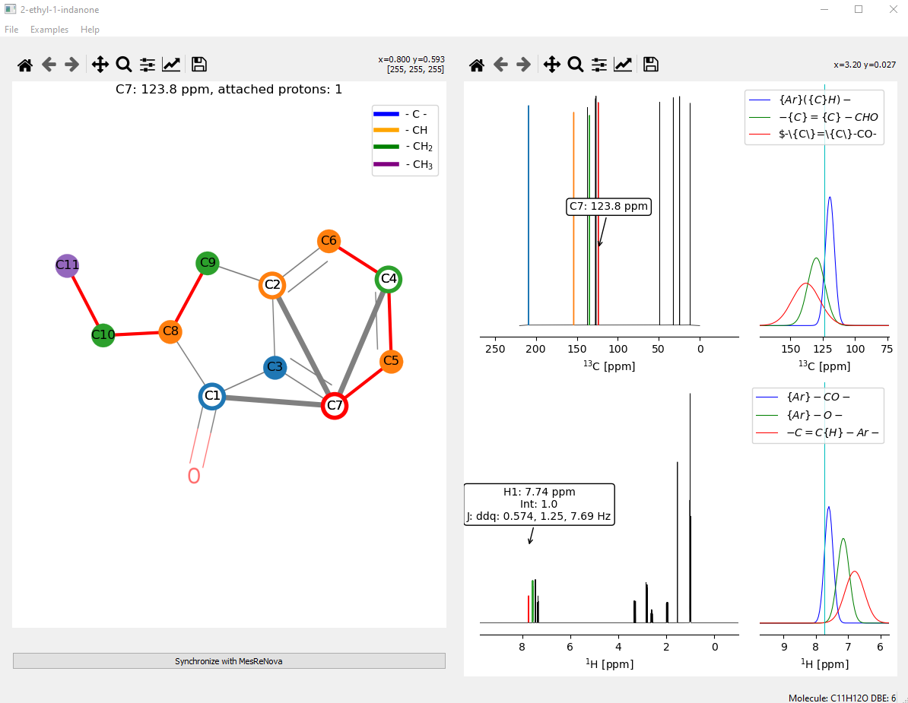

# simpleNMR

simpleNMR is a python/QT5/matplotlib program. It runs on windows and macos. The aim of the software is to present the information derived from processing NMR spectra using commercial software such as MestReNova (chemical shifts, integrals, coupling patterns, and correlations from standard 2D experiments) in a way that makes it easier for the user to understand and keep track of the information while verifying a proposed structure.

The program displays the data  in an interactive manner. The idea behind the program was to position it as an analysis tool between the raw data and the use of pencil and paper to analyse NMR data and commercial complete black box solutions that can provide an answer with very little manual intervention. The software takes a high level interactive approach to display the information from the NMR experiments in order quickly check if a proposed structure is consistent with the NMR data.

The screenshot below shows the main user interface of the program. It consists of two panels. THe left hand shows the proton and carbon 1-D spectra of the molecule. The right hand side panel shows an image of the proposed molecule provided by the user on top of which are placed the carbon atoms of the molecule. COSY data is shown as links between carbon atoms.  The carbon atooms/nodes can be moved over the background so that they align with the corresponding atoms in the proposed molecule. HMBC corelations are displayed on the molecule when the cursor is positioned over a carbon atom. The corresponding proton and carbon peaks are highlighted in the spectra panel.

Furthermore, when a peak is highlighed in the spectra panel, the peak is highlighted in red, if the peak has a corresponding carbon/proton peak it is  highlighted. HMBC correlations are shown by highlighting further peaks in different colours and showing the links in the molecule panel. Information on what the chemical shift might correspond to in terms of functional group is shown up in a pop-up.

## Installation

The program comes with a requirements file. Due to the use of the module RDKIT, the best way to install the software is to use a CONDA installation. RDKIT can be installed using pip, but requires a python version of 3.7

# Running the program

The program can be run from the command line by typing 

python simpleNMR.py

An example excel file can be loaded from the File dr
